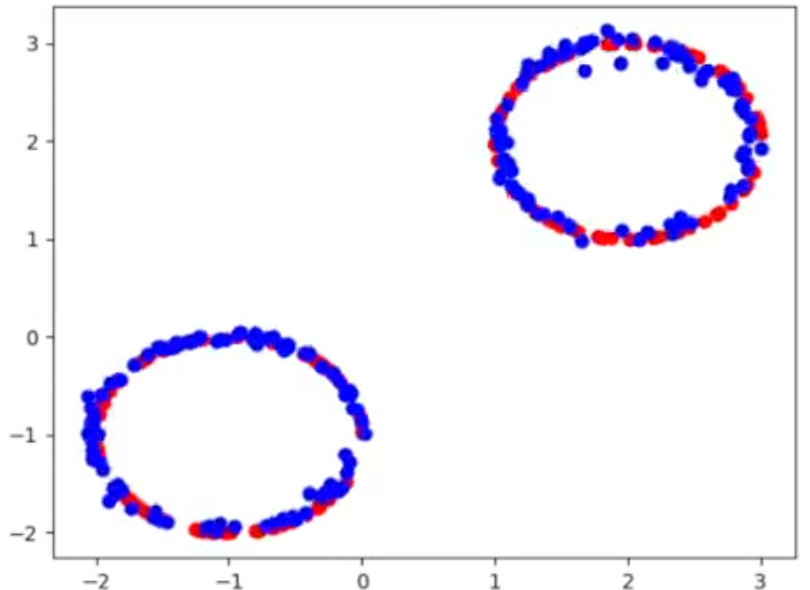
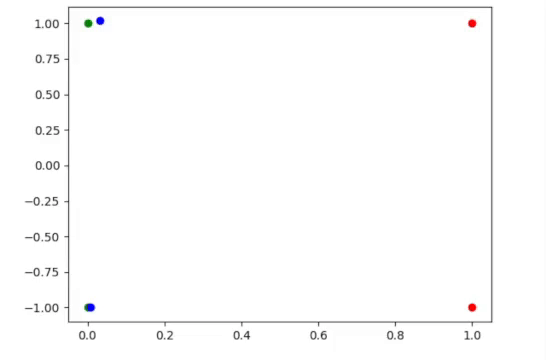

# normalizing_flows_with_stochastic_interpolants
Based on building normalizing flows with stochastic interpolants. ArXiv:2209.15571

visualization of the training mapping from a gaussian to a distribution of points looking like two different circles.  

final generated circles.  

The method pushes one distribution onto the other. So if one tries to cross flows (upper left to bottom right and botom left to top right),
it will result into a mapping that doesn't crossflows but correctly maps one distribution ontop of the other.  
An important thing to realize is that it doesn't map points it maps distributions to eachother, so you don't have direct control over what 
point ends up where.   Except if you would use (for example) classifier free guidance.   You can however use any initial distribution and map backwards and forwards determinisitically. 

Problem to measure mode collapse, as the point at the top has very low probability mass.  
